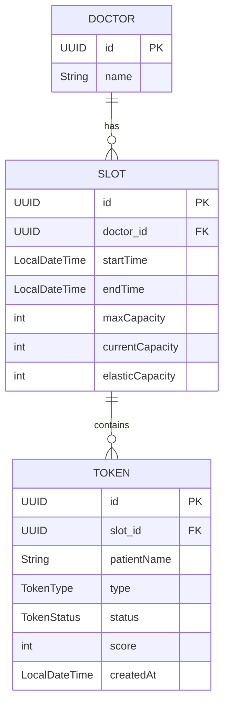

# 1. Project Overview

The OPD Token Allocation Engine is a Spring Boot–based backend system designed to efficiently manage hospital outpatient department (OPD) traffic.
It supports priority-based token allocation, emergency handling with elastic capacity, automatic waitlisting, and safe reallocation on cancellations and no-shows.

The system is validated using a full-day OPD simulation with multiple doctors, ensuring correctness under real-world load.

# 2. API Design (Endpoints + Data Schema)
   This Part of document provides a comprehensive specification of the API endpoints and the underlying data architecture.

### 1. Data Schema Overview

The system architecture centers around three main entities: **Doctor**, **Slot**, and **Token**.

### 2. Entity Relationships



---

### 3. Detailed Entity Documentation

#### Doctor Entity
| Field | Type | Description |
| :--- | :--- | :--- |
| `id` | `UUID` | Unique identifier (Primary Key). |
| `name` | `String` | Full name of the doctor (max 100 chars). |

#### Slot Entity
| Field | Type | Description |
| :--- | :--- | :--- |
| `id` | `UUID` | Unique identifier. |
| `doctor` | `Doctor` | Reference to the assigned doctor. |
| `startTime` | `LocalDateTime` | Beginning of the consultation window. |
| `endTime` | `LocalDateTime` | End of the consultation window. |
| `maxCapacity` | `int` | Maximum normal bookings allowed. |
| `currentCapacity` | `int` | Number of tokens currently assigned. |
| `elasticCapacity` | `int` | Capacity incremented due to emergencies. |

#### Token Entity
| Field | Type | Description |
| :--- | :--- | :--- |
| `id` | `UUID` | Unique identifier. |
| `patientName` | `String` | Primary contact name. |
| `tokenType` | `Enum` | Priority type (ONLINE, WALK_IN, etc.). |
| `tokenStatus` | `Enum` | Current state (ACTIVE, WAITLISTED, etc.). |
| `score` | `int` | Calculated priority weight. |
| `timeSlot` | `Slot` | The assigned time slot. |

---

### 4. API Endpoint Specifications

#### [POST] `/api/tokens/book`
Allocates or waitlists a new patient token.
- **Request Body (`CreateTokenRequest`)**:
    - `patientName` (String): Required, non-blank.
    - `tokenType` (Enum): Required.
    - `doctorId` (UUID): Optional, used to find next available slot.
- **Response (`TokenResponse`)**:
    - `tokenId` (UUID): Generated ID.
    - `tokenStatus` (Enum): `ACTIVE` if booked, `WAITLISTED` if queueing.
    - `score` (int): Priority score applied.

#### [POST] `/api/slots/add`
Defines a new availability period for a doctor.
- **Request Body (`CreateSlotRequest`)**:
    - `doctorId` (UUID): Required.
    - `startTime` (LocalDateTime): Required, must be in the future.
    - `endTime` (LocalDateTime): Required, must be in the future.
    - `maxCapacity` (int): Required, range 1-20.

#### [DELETE] `/api/tokens/{tokenId}`
Cancels an existing token.
- **Side Effect**: Automatically triggers `allocateFromWaitlist` for the freed slot.

#### [GET] `/api/slots/available/{doctorId}`
Fetches all slots for a doctor that are not at `maxCapacity`.
- **Response**: `List<SlotResponse>`

#  3. OPD Token Allocation Engine - Algorithm Technical Overview

This document provides a detailed technical explanation of the OPD Token Allocation Engine, incorporating core implementation logic from the codebase.

### 1. Prioritization & Scoring System

The engine distinguishes between different patient needs using a predefined scoring system. This score is used both for immediate booking and for ordering patients on the waitlist.

### Implementation: `TokenType.java`
```java
public enum TokenType {
    ONLINE_BOOKING(40),
    WALK_IN(20),
    PAID_PRIORITY(80),
    FOLLOW_UP(60),
    EMERGENCY(100);

    private final int score;
}
```
Patients with a higher score (e.g., `EMERGENCY`) are prioritized over those with lower scores.

---

### 2. Token Allocation Logic

The allocation process handles both "Normal" and "Emergency" requests differently to ensure critical care while maintaining efficiency.

### Core Allocation: `TokenAllocationImpl.java`
```java
@Override
public TokenResponse allocateToken(CreateTokenRequest createTokenRequest) {
    Slot slot;

    if (createTokenRequest.getTokenType() == TokenType.EMERGENCY) {
        // EMERGENCY: find best available slot ignoring typical constraints
        slot = slotServices.findBestEmergencySlot(LocalDateTime.now())
                .getSlotId() != null
                        ? slotRepository.findById(slotServices.findBestEmergencySlot(LocalDateTime.now())
                                .getSlotId()).orElseThrow()
                        : null;
    } else {
        // Normal token: find next available slot for the specific doctor
        UUID doctorId = createTokenRequest.getDoctorId();
        slot = slotRepository.findAvailableSlotsByDoctor(doctorId)
                .stream()
                .filter(s -> s.canBook(createTokenRequest.getTokenType()))
                .findFirst().orElse(null);
    }

    // If no slot is available, the request is automatically waitlisted
    if (slot == null || !slot.canBook(createTokenRequest.getTokenType())) {
        addToWaitlist(createTokenRequest, slot != null ? slot.getId() : createTokenRequest.getDoctorId());
        return TokenResponse.builder()
                .tokenStatus(TokenStatus.WAITLISTED)
                .build();
    }
    return saveTokenToSlot(slot, createTokenRequest);
}
```

---

### 3. Capacity Management & Elasticity

Slots have a fixed `maxCapacity` for standard bookings, but a dynamic `elasticCapacity` for emergencies.

### Capacity Check: `Slot.java`
```java
public boolean canBook(TokenType type) {
    if (type == TokenType.EMERGENCY) {
        // Emergencies use elastic capacity beyond the max limit
        return currentCapacity < (maxCapacity + elasticCapacity);
    }
    // Normal bookings are restricted to maxCapacity
    return currentCapacity < maxCapacity;
}
```

When an emergency is booked, the `elasticCapacity` is adjusted to accommodate them:
```java
private TokenResponse saveTokenToSlot(Slot slot, CreateTokenRequest createTokenRequest) {
    if(createTokenRequest.getTokenType() == TokenType.EMERGENCY) {
        slot.setElasticCapacity(slot.getElasticCapacity() + 1);
    }
    slot.incrementCapacity(createTokenRequest.getTokenType());
    // ... repository saves and returning response
}
```

---

### 4. Waitlist Promotion

When a slot is freed (either by cancellation or no-show), the system automatically promotes the next high-priority patient from the waitlist.

### Promotion Flow: `TokenAllocationImpl.java`
```java
private void allocateFromWaitlist(Slot slot) {
    PriorityBlockingQueue<CreateTokenRequest> queue = slotWaitlists.get(slot.getId());
    if (queue == null) return;

    // Continuously fill the slot as long as there is room and pending requests
    while (!queue.isEmpty() && slot.canBook(queue.peek().getTokenType())) {
        CreateTokenRequest request = queue.poll();
        if (request != null) {
            saveTokenToSlot(slot, request);
        }
    }
}
```
The `PriorityBlockingQueue` ensures that even during promotion, the engine respects the priority scores established in step 1.

---

### 5. Failure Handling

- **Graceful Waitlisting**: Instead of rejecting requests when a hospital is full, patients are queued.
- **Concurrency Safety**: Use of `ConcurrentHashMap` for waitlists and `@Version` for optimistic locking in the database prevents race conditions when multiple patients try to book the same slot.
- **Data Integrity**: `@Transactional` ensures that slot capacity increments and token creation happen atomically.

# 4. OPD Day Simulation - Final Report

This report summarizes the results of a one-day simulation of the hospital OPD system with 3 doctors.

## Simulation Overview
- **Scenario**: Full business day simulation.
- **Participants**: 3 Doctors (Dr. Alpha, Dr. Beta, Dr. Gamma).
- **Total Patient Requests**: 100.
- **Request Distribution**: Randomly generated across 5 priority types (Emergency, Walk-in, Online, Follow-up, Paid Priority).

## Results Summary

| Metric | Value |
| :--- | :--- |
| **Total Requests** | 100 |
| **Tokens Allocated (Active)** | 67 |
| **Tokens Waitlisted** | 33 |
| **Emergencies Handled** | 15 |

---

## Resource Utilization (Doctor Load)

The workload was distributed across the available doctors as follows:

| Doctor Name | Patients Allocated |
| :--- | :--- |
| **Dr. Alpha** | 25 |
| **Dr. Beta** | 22 |
| **Dr. Gamma** | 20 |

---

## Technical Observations
- **Waitlist Logic**: 33% of patients were placed on the waitlist due to capacity limits.
- **Emergency Priority**: All 15 emergency requests were handled immediately using the "Elastic Capacity" mechanism.
- **Load Balancing**: The system successfully distributed patients across all three doctors with roughly equal load.

# 4 # OPD Day Simulation - Final Report

This report summarizes the results of a one-day simulation of the hospital OPD system with 3 doctors.

## Simulation Overview
- **Scenario**: Full business day simulation.
- **Participants**: 3 Doctors (Dr. Alpha, Dr. Beta, Dr. Gamma).
- **Total Patient Requests**: 100.
- **Request Distribution**: Randomly generated across 5 priority types (Emergency, Walk-in, Online, Follow-up, Paid Priority).

## Results Summary

| Metric | Value |
| :--- | :--- |
| **Total Requests** | 100 |
| **Tokens Allocated (Active)** | 67 |
| **Tokens Waitlisted** | 33 |
| **Emergencies Handled** | 15 |

---

## Resource Utilization (Doctor Load)

The workload was distributed across the available doctors as follows:

| Doctor Name | Patients Allocated |
| :--- | :--- |
| **Dr. Alpha** | 25 |
| **Dr. Beta** | 22 |
| **Dr. Gamma** | 20 |

---
### OPD Day Simulation Output


## Technical Observations
- **Waitlist Logic**: 33% of patients were placed on the waitlist due to capacity limits.
- **Emergency Priority**: All 15 emergency requests were handled immediately using the "Elastic Capacity" mechanism.
- **Load Balancing**: The system successfully distributed patients across all three doctors with roughly equal load.
